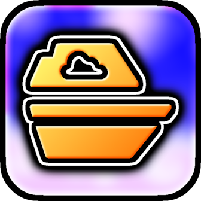
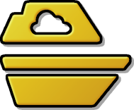
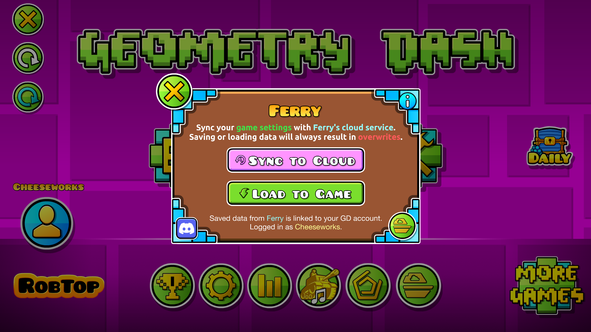
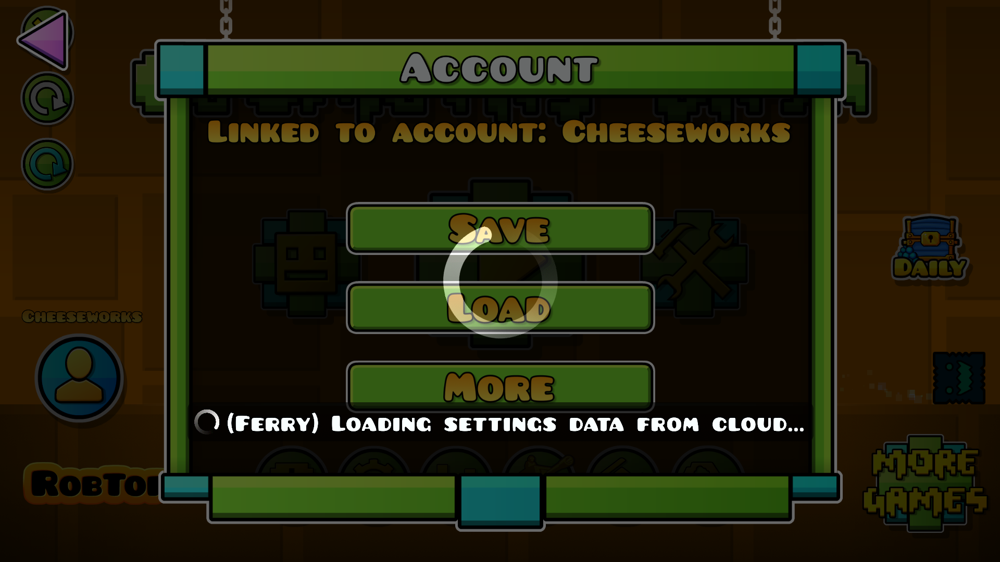

#  Ferry
Sync your game client settings!

>   

>  
>  
> 

> [!TIP]
> *This mod has settings you can utilize to customize your experience.*

---

## About
This mod allows you to **save your GD settings to a cloud service**, so you can synchronize them across multiple devices!

> [!NOTE]
> *This is an **online** mod. **Check [status.cheeseworks.gay](https://status.cheeseworks.gay/)** before reporting any connectivity issues!*

---

### Syncing
A ** button will appear on the main menu, which will open a pop-up when you press it. You can either upload or download your settings to and from the Ferry cloud server. Either option will **overwrite** previous data.

> [!TIP]
> *Synced data also includes editor settings!*

#### Seamless Sync
You can automatically trigger Ferry's sync processes when syncing your account through Geometry Dash. In the mod settings, you can choose if you want cloud sync to automatically start at the same time you either save or load your GD account's data.

### Why?
Sometimes, you might find yourself starting over on a new GD installation, meaning all your data is gone, including your game settings which you've gotten accustomed to. However, unlike with account stats, Geometry Dash won't let you sync your game settings across clients or devices. **This mod provides a solution for that**.

> [!NOTE]
> *More options for sync such as Geode mod settings are planned in future updates!*

---

### Credits
- **[dankmeme](https://www.github.com/dankmeme01/)**: Meaningful guidance for this mod's implementation

---

---

### Changelog
###### What's new?!
**[📜 View the latest updates and patches](./changelog.md)**

### Issues
###### What's wrong?!
**[⚠️ Report a problem with the mod](../../issues/)**